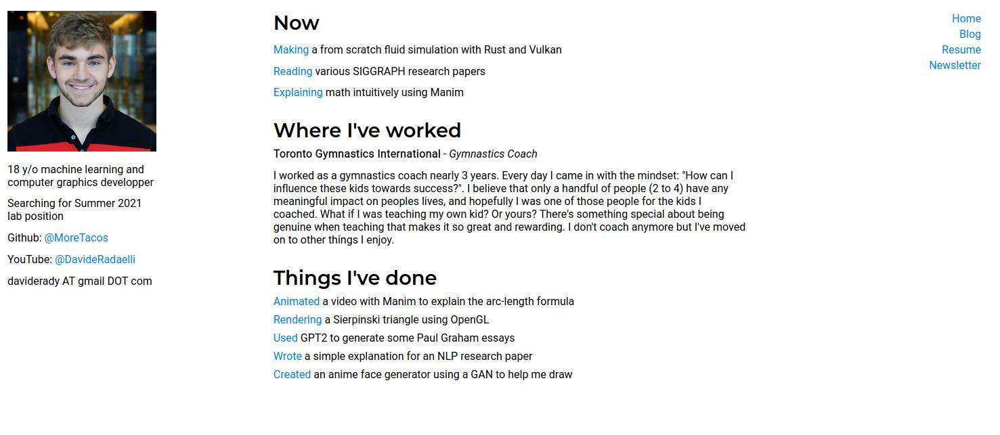

# My Personal Website
Automatic static site generator build system for easy automation

## About The Project
I got tired of constantly having to dive into my HTML files to change my website, and especially of copy pasting my blogs into HTML files, so I built a static site generator that takes information from TOML and Markdown files to build the site.

## Built With
Rust and Handlebars for the index and blog main page, and Pandoc + Markdown for the listed blogs. Blogs are sorted by date (information was parsed from Markdown files)

## Usage
You will need to download some packages if you want to use this template. Makefiles are used to puppet control the build system. If you want to know the specific packages required, please send me an email.

## Contact
Davide Radaelli - @daviderady - daviderady AT gmail DOT com
Project Link: https://github.com/MoreTacos/personal_web